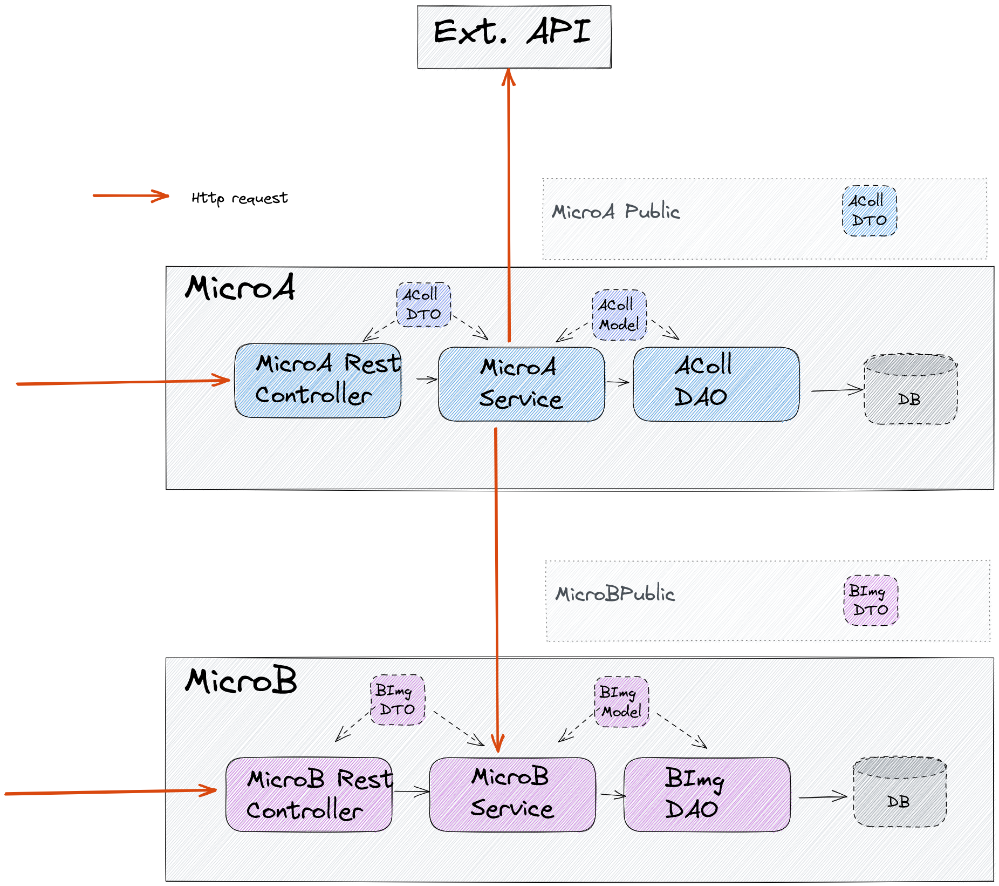

# ASI2-Microservices-Archi-basic-example

Exemple simple d'une architecture microservice (hors reverse proxy).
- 1 microservice A
- 1 microservice B

## Fonctionnement:

Pour créer l'objet ACollection le micro service a besoin d'information du microservice B (/random) et d'une API extérieur (https://api.chucknorris.io/jokes/random)
le micro Serivce appelle ces 2 API via RestTemplate (requète HTTP)

## Image d'architecture

