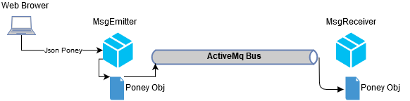
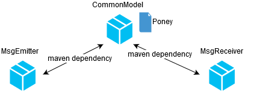

# Message Emitter - Receiver : How to send Java Object ?
## Project organisation

The following workflow is defined:



- A user send information about a **Poney** to the **MsgEmitter**.
- Information is converted into java Object
- Then the java object is send to the communication Bus
- MsgReceiver get back the information and convert it into Java object

To do so, MsgEmitter an MsgReceiver shares a common object **Poney**
The following maven dependency is needed:




## Realisation
### 1 Create a new maven project called **CommonModel**
Here the related **pom.xml**

```xml
<?xml version="1.0" encoding="UTF-8"?>
<project xmlns="http://maven.apache.org/POM/4.0.0"
         xmlns:xsi="http://www.w3.org/2001/XMLSchema-instance"
         xsi:schemaLocation="http://maven.apache.org/POM/4.0.0 http://maven.apache.org/xsd/maven-4.0.0.xsd">
    <groupId>com.cpe.springboot</groupId>
    <artifactId>CommonModel</artifactId>
    <version>0.0.1-SNAPSHOT</version>
    <artifactId>CommonModel</artifactId>
    <description>Common content used by MsgEmitter and MsgReceiver</description>  
</project>
```

### 2 Add the java object **Poney** to the **CommonModel** project

```java
package com.cpe.springboot.model;

import java.io.Serializable;

public class Poney  implements Serializable {

    private static final long serialVersionUID = 1069270118228032176L;

    private String name;
    private String description;
    private String super_power;
    private Integer velocity;
    private Integer energy;

    public Poney() {
    }

    public Poney(String name, String description, String super_power, Integer velocity, Integer energy) {
        this.name = name;
        this.description = description;
        this.super_power = super_power;
        this.velocity = velocity;
        this.energy = energy;
    }

    public String getName() {
        return name;
    }

    public void setName(String name) {
        this.name = name;
    }

    public String getDescription() {
        return description;
    }

    public void setDescription(String description) {
        this.description = description;
    }

    public String getSuper_power() {
        return super_power;
    }

    public void setSuper_power(String super_power) {
        this.super_power = super_power;
    }

    public Integer getVelocity() {
        return velocity;
    }

    public void setVelocity(Integer velocity) {
        this.velocity = velocity;
    }

    public Integer getEnergy() {
        return energy;
    }

    public void setEnergy(Integer energy) {
        this.energy = energy;
    }


    @Override
    public String toString() {
        return display();
    }

    public String display(){
        String result;
        result="["+getName()+"],\n\t description: \n \t\t"+getDescription()+"\n\t"+
                                 "super_power: \n\t\t"+getSuper_power()+"\n\t"+
                                 "velocity: \n\t\t"+getVelocity()+"\n\t"+
                                 "energy: \n\t\t"+getEnergy()+"\n\t";

        return result;
    }
}
```

Explanation

```java
...
public class Poney  implements Serializable {
...
```
The current object will transit through http request and communication bus, it must be serializable to be succeded transform.

```java
...
private static final long serialVersionUID = 1069270118228032176L;
...
```

```serialVersionUID``` represents the HASH key of the current Class, it is used to check during conversion if the targeted object is the same than the origin. Setting serialVersionUID is needed otherwise emitter and receiver compute their own serialVersionUID that could be different


### 3 Add **CommonModel** as dependency for MsgEmitter and MsgReceiver project
Add the following line to the **pom.xml** file of both projects


```xml
  <dependencies>
    ...
    <dependency>
                <groupId>com.cpe.springboot</groupId>
                <artifactId>CommonModel</artifactId>
                <version>1.0-SNAPSHOT</version>
    </dependency>
    ...
</dependencies>

```

### 4 Modify **MsgEmitter** to send **Poney** Object 
First change the **MsgEmitterRestController** as follow:

```java
package com.cpe.springboot.msgemitter.comm;

import ...

@RestController
public class MsgEmitterRestController {

    @Autowired
    BusService busService;

    @RequestMapping(method = RequestMethod.POST, value = "/sendmsg")
    public boolean sendInform(@RequestBody Poney msg) {
        busService.sendMsg(msg);
        return true;
    }

    @RequestMapping(method = RequestMethod.POST, value = "/sendmsg/{busName}")
    public boolean sendInform(@RequestBody Poney msg, @PathVariable String busName) {
        busService.sendMsg(msg,busName);
        return true;
    }

}
```

Then update the **BusService** as follow 

```java
package com.cpe.springboot.msgemitter.comm.controller;

import ...

@Service
public class BusService {

    @Autowired
    JmsTemplate jmsTemplate;

    public void sendMsg(Poney poney) {
        System.out.println("[BUSSERVICE] SEND String MSG=["+poney+"]");
        jmsTemplate.convertAndSend("RESULT_BUS_MNG",poney);
    }

    public void sendMsg(Poney poney, String busName) {
        System.out.println("[BUSSERVICE] SEND String MSG=["+poney+"] to Bus=["+poney+"]");
        jmsTemplate.convertAndSend(busName,poney);
    }
}
```

Your **MsgEmitter** send now **Poney** object over the communication bus.


### 4 Modify **MsgReceiver** to receive **Poney** Object 
Simply change the **BusListener** as follow:

```java
package com.cpe.springboot.msgreceiver.comm.controller;

import ...


@Component
public class BusListener {

    @Autowired
    JmsTemplate jmsTemplate;

    @JmsListener(destination = "RESULT_BUS_MNG", containerFactory = "connectionFactory")
    public void receiveMessageResult(Poney poney, Message message) {

            System.out.println("[BUSLISTENER] [CHANNEL RESULT_BUS_MNG] RECEIVED Poney MSG=["+poney+"]");

    }

    @JmsListener(destination = "A", containerFactory = "connectionFactory")
    public void receiveMessageA(Poney poney, Message message) {

        System.out.println("[BUSLISTENER] [CHANNEL A] RECEIVED Poney MSG=["+poney+"]");

    }

    @JmsListener(destination = "B", containerFactory = "connectionFactory")
    public void receiveMessageB(Poney poney, Message message) {

        System.out.println("[BUSLISTENER] [CHANNEL B] RECEIVED Poney MSG=["+poney+"]");

    }
}
```

### 5 Check that everything works
- Start activeMq server (if not already started)
- Run MsgEmitter project (e.g on port 8082)
- Run MsgReceiver project (e.g on port 8083)
- Send a message to your SpringBoot application (e.g [postman](https://www.getpostman.com/)) with the following parameters:
  - HTTP METHOD: ```POST```
  - URL:         ```localhost:8082/sendmsg```  
  - Body: 
        ``` {
	"name": "purple_boy",
	"description":"big boss",
	"super_power": "ultra speed",
	"velocity":1000,
	"energy": 50
} ```
- check that the message is logged on the MsgReceiver side on the bus channel "RESULT_BUS_MNG"

```
[BUSLISTENER] [CHANNEL RESULT_BUS_MNG] RECEIVED Poney MSG=[[purple_boy],
	 description: 
 		big boss
	super_power: 
		ultra speed
	velocity: 
		1000
	energy: 
		50
	]
```