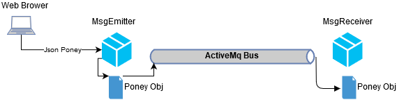
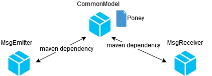

# Message Emitter - Receiver : How to send JSON Object ? How to send and receive messages to queues and topics ?
## Project organisation

The following workflow is defined:



- A user send information about a **Poney** to the **MsgEmitter**.
- Information is converted into java Object
- Then the java object is serialized in JSON and send to the communication Bus
- MsgReceiver get back the information and convert it into Java object

To do so, MsgEmitter an MsgReceiver shares a common object **Poney**
The following maven dependency is needed:




## Realisation


### 1 Modify **MsgEmitter** to convert **Poney** and send JSON object to queues and topics
Update the **BusService** as follow:

```java
package com.cpe.springboot.msgemitter.comm.controller;

import com.cpe.springboot.model.Poney;
import com.fasterxml.jackson.core.JsonProcessingException;
import com.fasterxml.jackson.databind.ObjectMapper;
import org.springframework.beans.factory.annotation.Autowired;
import org.springframework.jms.core.JmsTemplate;
import org.springframework.stereotype.Service;

import javax.jms.TextMessage;

@Service
public class BusService {

    @Autowired
    JmsTemplate jmsTemplate;

    @Autowired
    ObjectMapper objectMapper;

    public void sendMsg(Poney poney) {
        sendMsg(poney, "RESULT_BUS_MNG");
    }

    public void sendMsg(Poney poney, String busName) {
        System.out.println("[BUSSERVICE] SEND String MSG=["+poney+"] to Bus=["+busName+"]");

        jmsTemplate.send(busName, s -> {
            try {
                TextMessage msg = s.createTextMessage(objectMapper.writeValueAsString(poney));
                msg.setStringProperty("Content-Type", "application/json");
                msg.setStringProperty("ObjectType", poney.getClass().getCanonicalName());

                return msg;
            } catch (JsonProcessingException e) {
                throw new RuntimeException(e);
            }
        });
    }
}
```

Then change the **App** as follow 

```java
package com.cpe.springboot.msgemitter;

import org.springframework.boot.SpringApplication;
import org.springframework.boot.autoconfigure.SpringBootApplication;
import org.springframework.context.annotation.Bean;
import org.springframework.jms.annotation.EnableJms;
import org.springframework.jms.support.destination.DynamicDestinationResolver;

import javax.jms.Destination;
import javax.jms.JMSException;
import javax.jms.Session;

@EnableJms
@SpringBootApplication
public class App {

    @Bean
    public DynamicDestinationResolver destinationResolver() {
        return new DynamicDestinationResolver() {
            @Override
            public Destination resolveDestinationName(Session session, String destinationName, boolean pubSubDomain) throws JMSException {
                String prefixTopic = "topic.";
                String prefixQueue = "queue.";
                if (destinationName.startsWith(prefixTopic) || destinationName.startsWith(prefixQueue)) {
                    if (destinationName.startsWith(prefixTopic)) {
                        pubSubDomain = true;
                        destinationName = destinationName.replace(prefixTopic, "");
                    } else {
                        destinationName = destinationName.replace(prefixQueue, "");
                    }
                }
                return super.resolveDestinationName(session, destinationName, pubSubDomain);
            }
        };
    }

    public static void main(String[] args) {
        SpringApplication.run(App.class, args);
    }
}
```

With this bean destinationResolver, we can now dynamically choose to send messages on topic or queue:
- if we call the method `jmsTemplate.send` with the destination `queue.myqueue`, it will send a message on a Queue "myqueue"
- if we call the method `jmsTemplate.send` with the destination `topic.mytopic`, it will send a message on a Topic "mytopic"
- if we call the method `jmsTemplate.send` with the destination with no prefix, it will send a message on a Queue with the same name

### 2 Modify **MsgReceiver** to receive JSON on queue and topics, and convert it to Java Object
First, change the **App** as follow:

```java
package com.cpe.springboot.msgreceiver;

import org.springframework.boot.SpringApplication;
import org.springframework.boot.autoconfigure.SpringBootApplication;

@SpringBootApplication
public class App {

    public static void main(String[] args) {
        SpringApplication.run(App.class, args);
    }
}
```

Then create **JmsConfig.java** file next to App.java

```java
package com.cpe.springboot.msgreceiver;

import org.springframework.boot.autoconfigure.jms.DefaultJmsListenerContainerFactoryConfigurer;
import org.springframework.context.annotation.Bean;
import org.springframework.context.annotation.Configuration;
import org.springframework.jms.annotation.EnableJms;
import org.springframework.jms.config.DefaultJmsListenerContainerFactory;
import org.springframework.jms.config.JmsListenerContainerFactory;

import javax.jms.ConnectionFactory;

@Configuration
@EnableJms
public class JmsConfig {

    @Bean
    public JmsListenerContainerFactory<?> queueConnectionFactory(ConnectionFactory connectionFactory,
                                                                 DefaultJmsListenerContainerFactoryConfigurer configurer) {
        DefaultJmsListenerContainerFactory factory = new DefaultJmsListenerContainerFactory();
        // This provides all boot's default to this factory, including the message converter
        configurer.configure(factory, connectionFactory);
        // You could still override some of Boot's default if necessary.

        // Queue mode
        factory.setPubSubDomain(false);
        return factory;
    }

    @Bean
    public JmsListenerContainerFactory<?> topicConnectionFactory(ConnectionFactory connectionFactory,
                                                                 DefaultJmsListenerContainerFactoryConfigurer configurer) {
        DefaultJmsListenerContainerFactory factory = new DefaultJmsListenerContainerFactory();
        // This provides all boot's default to this factory, including the message converter
        configurer.configure(factory, connectionFactory);
        // You could still override some of Boot's default if necessary.

        // Topic mode
        factory.setPubSubDomain(true);
        return factory;
    }
}
```

This file create 2 connection factories: one to listen to Queues and the other to listen to Topics.

We can now change **BusListener** to select a ConnectionFactory:

```java
package com.cpe.springboot.msgreceiver.comm.controller;

import com.cpe.springboot.model.Poney;
import com.fasterxml.jackson.databind.ObjectMapper;
import org.springframework.beans.factory.annotation.Autowired;
import org.springframework.jms.annotation.JmsListener;
import org.springframework.jms.core.JmsTemplate;
import org.springframework.stereotype.Component;

import javax.jms.JMSException;
import javax.jms.TextMessage;
import java.io.IOException;

@Component
public class BusListener {

    @Autowired
    JmsTemplate jmsTemplate;

    @Autowired
    FakePoneyDao poneyDao;

    @Autowired
    ObjectMapper objectMapper;

    private void doReceive(String busName, TextMessage message) {
        try {
            String clazz = message.getStringProperty("ObjectType");
            Object o = objectMapper.readValue(message.getText(), Class.forName(clazz));

            if (o instanceof Poney) {
                Poney poney = (Poney)o;
                poneyDao.addPoney(poney);
            }

            System.out.println("[BUSLISTENER] [CHANNEL "+busName+"] RECEIVED String MSG=["+message.getText()+"]");
        } catch (IOException | JMSException | ClassNotFoundException  e) {
            throw new RuntimeException(e);
        }
    }

    @JmsListener(destination = "RESULT_BUS_MNG", containerFactory = "queueConnectionFactory")
    public void receiveMessageResult(TextMessage message) {
        doReceive("RESULT_BUS_MNG", message);
    }

    @JmsListener(destination = "A", containerFactory = "queueConnectionFactory")
    public void receiveMessageA(TextMessage message) {
        doReceive("A", message);
    }

    @JmsListener(destination = "B", containerFactory = "topicConnectionFactory")
    public void receiveMessageB(TextMessage message) {
        doReceive("B", message);
    }
}
```

### 3 Check that everything works
- Start activeMq server (if not already started)
- Run MsgEmitter project (e.g on port 8082)
- Run MsgReceiver project (e.g on port 8083)
- Send a message to your SpringBoot application (e.g [postman](https://www.getpostman.com/)) with the following parameters:
  - HTTP METHOD: ```POST```
  - URL:         ```localhost:8082/sendmsg/queue.A```  
  - Body: 
        ``` {
	"name": "purple_boy",
	"description":"big boss",
	"super_power": "ultra speed",
	"velocity":1000,
	"energy": 50
} ```
- check that the message is logged on the MsgReceiver side on the bus Queue "A"

```
[BUSLISTENER] [CHANNEL A] RECEIVED Poney MSG=[[purple_boy],
	 description: 
 		big boss
	super_power: 
		ultra speed
	velocity: 
		1000
	energy: 
		50
	]
```
- Send another message to your SpringBoot application with the following parameters:
  - HTTP METHOD: ```POST```
  - URL:         ```localhost:8082/sendmsg/topic.B```  
  - Body: 
        ``` {
	"name": "purple_boy",
	"description":"big boss",
	"super_power": "ultra speed",
	"velocity":1000,
	"energy": 50
} ```
- check that the message is logged on the MsgReceiver side on the bus Topic "B"

```
[BUSLISTENER] [CHANNEL B] RECEIVED Poney MSG=[[purple_boy],
	 description: 
 		big boss
	super_power: 
		ultra speed
	velocity: 
		1000
	energy: 
		50
	]
```
